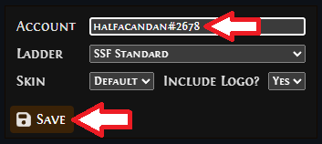
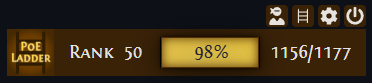

# PoE Ladder Desktop app

The **PoE Ladder Desktop** app is a lightweight desktop application that connects to the [poeladder.com website](https://poeladder.com/) to display your current ranking in a Path of Exile league, based on the number of unique items that you have found. Once configured with your account details, it automatically stays on top of your other windows—similar to a sticky note or widget—so you can monitor your rank while playing or doing other tasks.

The content refreshes every 5 minutes so you'll be able to see changes in your ranking over time.

## Setting up the app

You can get started really quickly. All you need to do is:

1. [Download the latest release](https://github.com/halfacandan/PoELadderDesktop/releases)
2. Click the Cog icon to configure the app

    

3. Enter a user account with discriminator (e.g. halfacandan#2678), select the relevant ladder, then click the **Save** button

    

4. You should then see details of your account's rank for the selected ladder

    

## Code signing policy

Please see this document for [full details of the PoE Ladder Desktop's code signing policy](docs/code-signing-policy.md).

## Technical details

### Data and Privacy

- **Local storage only**: Your account settings are stored only on your computer. The app does not send your personal information to any external servers (other than poeladder.com when retrieving your ranking data, which is at your request).
- **Automatic updates**: Your ranking information refreshes automatically every 5 minutes so you always see your current progress.
- **No tracking**: This application does not track your usage or collect analytics.

### System Requirements

The PoE Ladder Desktop app is available for Windows, macOS, and Linux. It requires minimal system resources and runs in the background alongside your other applications.

### Uninstallation

The PoE Ladder Desktop app is based on the [Electron app framework](https://www.electronjs.org/). This provides native tooling to uninstall the application from your specific operating system. No manual intervention is required.

## Acknowledgements

This project uses the [Electron Builder Action](https://github.com/marketplace/actions/electron-builder-action) to package and release.

This project uses [Free code signing provided by SignPath.io](https://signpath.io/).

## Contributing

Please feel free to [raise an issue](https://github.com/halfacandan/PoELadderDesktop/issues) if you encounter any problems or if you'd like a new feature added.